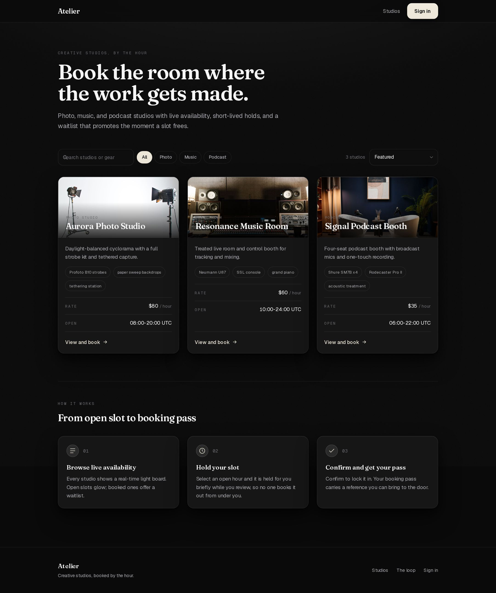
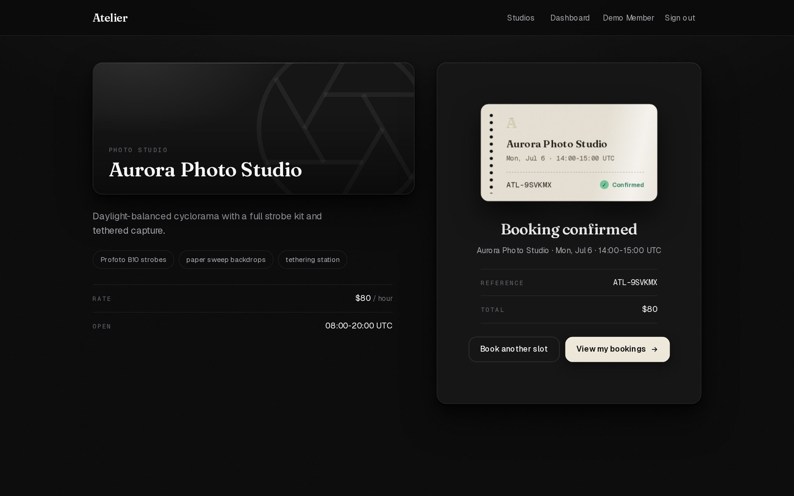
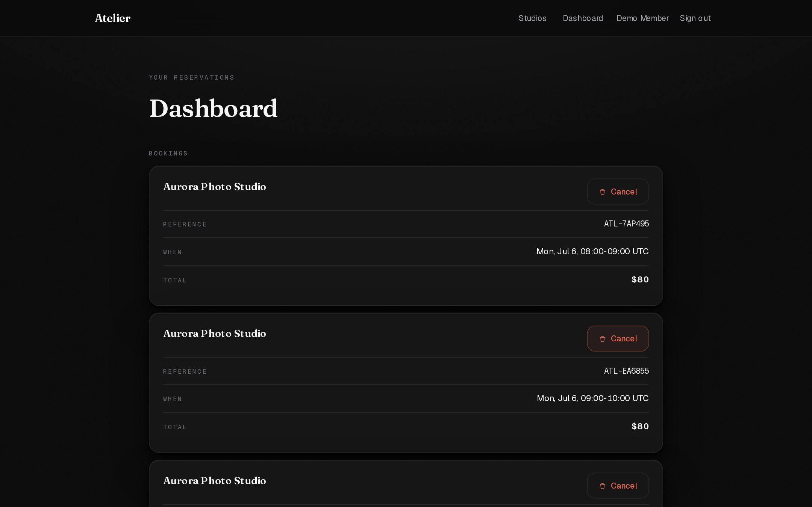
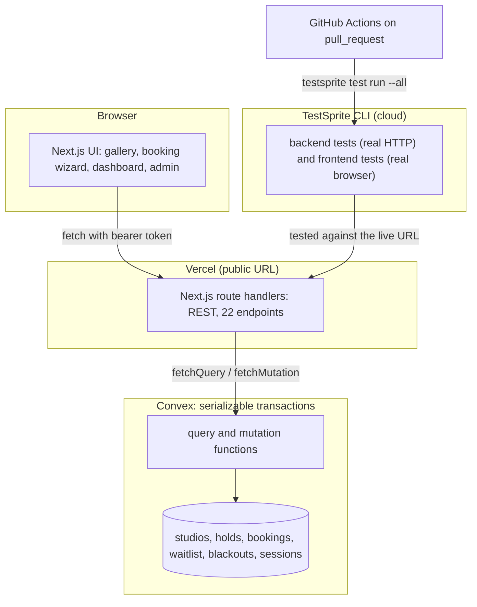

<p align="center"></p>

<h1 align="center">Atelier</h1>

<p align="center">
A reservation engine for creative studios (photo, music, podcast) where no two
confirmed bookings can ever overlap, enforced inside a single serializable
database transaction, and where every endpoint was verified against the live URL
by the TestSprite CLI before it shipped.
</p>

<p align="center">Built for the TestSprite Hackathon Season 3, "Build the Loop" (Project Awards track).</p>

<p align="center">


</p>

Live: **https://atelier-studios-opal.vercel.app** &nbsp;|&nbsp; The loop journal, live in the app: **[/loop](https://atelier-studios-opal.vercel.app/loop)**



| Booking confirmed (the ivory pass) | Your dashboard |
| --- | --- |
|  |  |

## 🎯 The problem

Booking a shared, time-boxed resource is a concurrency problem wearing a calendar.
Two people open the same 10:00 slot, both click confirm, and a naive backend writes
both: a double-booking that someone discovers only when they show up to a room that
is already in use. The usual patches (a uniqueness check just before the insert, an
optimistic "probably fine") still lose the race under real concurrency.

Atelier treats the slot as the unit that must never be sold twice. The rule ("for a
studio, the active holds, confirmed bookings, and blackouts are pairwise
non-overlapping") is an invariant enforced where the write happens, not a hope
expressed in the UI. And because a hackathon about testing should prove its own
correctness, every rule here is checked by the TestSprite CLI against the deployed
app, not asserted in a slide.

## 🧭 What it does

- **Holds with a TTL.** Selecting an open slot creates a short-lived hold
  (`HOLD_TTL_SECONDS`, default 600). Expiry is lazy: a hold past `expiresAt` is
  treated as dead at every read, so behavior does not depend on a background job.
- **Confirm to a sealed booking.** Confirming a hold mints a booking with a unique
  `ATL-XXXXXX` reference. Confirming the same hold again returns the same booking,
  never a duplicate (idempotent).
- **A hard anti-overlap invariant.** A hold or booking that overlaps an active hold,
  a confirmed booking, or a blackout is rejected with a distinct `409 SLOT_CONFLICT`.
  The check-then-insert runs inside one Convex mutation (a serializable
  transaction), so it is race-free.
- **Waitlist with automatic promotion.** Joining a full slot returns a position; when
  the booking holder cancels, the first waiting member is promoted into a fresh
  active hold, so the slot is held for them rather than raced for.
- **Roles and blackouts.** Members book; admins manage studios and create blackout
  windows that cancel the bookings inside them. Every admin action is gated inside
  Convex, so a direct call to the public database URL is equally protected.
- **A live build journal.** The [`/loop`](https://atelier-studios-opal.vercel.app/loop)
  page renders `LOOP.md`: the app shows its own write-verify-fix-verify history.

## 🏗 How it works



The diagram shows the happy path; the edges the loop actually hardened are the
unhappy ones. An overlapping hold gets `409 SLOT_CONFLICT` from inside the mutation.
A confirm on an expired hold gets `410 HOLD_EXPIRED` (lazy expiry marks it on the
way through). A member cancelling under the two-hour cutoff gets
`403 OUTSIDE_CANCEL_WINDOW`, while an admin bypasses it. A blackout over a booked
slot cancels the booking and reports how many it cancelled. Auth is a bearer token
whose only stored form is a sha-256 hash computed inside Convex, so a leaked session
row cannot be replayed without the token preimage.

### The one deep dive: the banked test suite

Every row is a test the CLI ran against the live URL and banked on the TestSprite
platform. Backend runs are free, so the API suite carries the loop; frontend runs
use a real cloud browser.

| Test | Type | What it protects | Verdict |
| --- | --- | --- | --- |
| health endpoint | backend | deploy marker and liveness | passed |
| auth lifecycle | backend | register, login, `/me`, logout, duplicate-email 409 | passed |
| anti-overlap invariant | backend | the no-double-booking rule (409 on conflict) | passed |
| authorization and validation | backend | 401 / 403 walls, past-slot 422, misaligned 400 | passed |
| waitlist promotion on cancel | backend | promotion into a fresh hold, `SLOT_NOT_FULL` | passed |
| admin studio crud | backend | admin create/update/soft-delete, member 403 | passed |
| blackout cancels booking | backend | blackout wins over an existing booking | passed |
| hold ownership edges | backend | foreign confirm 403, unknown hold 404 | passed |
| availability respects the horizon | backend | no `free` slot beyond the 30-day horizon; `422 BEYOND_HORIZON` | passed |
| home gallery lists studios | frontend | the gallery renders with rates | passed |
| creating an account reaches the dashboard | frontend | register, then land on the dashboard | passed |
| admin console with studios and blackout | frontend | admin reaches the operations console | passed |
| booking wizard to confirmation | frontend | full sign-in, hold, confirm flow | verified on video (see honesty) |
| wrong password shows an error | frontend | the login failure path | verified on video (see honesty) |

## 🔁 The loop caught real issues

The loop is only worth its points if it catches things. Three concrete examples, each
in `LOOP.md` with matching platform runs and commits:

- **The tests were not actually running.** The first backend tests reported
  `passed`, but the pass was empty: the TestSprite backend runner executes a file
  top to bottom and does not auto-collect pytest `test_*` functions, so a test that
  is defined but never called passes without running a single assertion. An
  intentional-failure probe (assert HTTP 599) proved the point: with the function
  actually invoked, the checker correctly returned `failed`. Every test now invokes
  its function at the end of the file. Without the checker, this would have shipped
  as green-looking nothing.
- **A login timing side-channel.** The pre-submission audit
  ([docs/hackathon/AUDIT.md](docs/hackathon/AUDIT.md)) found that an unknown email
  returned 401 immediately while a known email ran scrypt, letting an attacker
  enumerate accounts by timing. Fixed by running one scrypt against a dummy hash on
  the unknown-email path so both return in the same time, then re-verified through
  the `auth lifecycle` test.
- **Availability advertised slots the engine would reject.** A checker-written backend
  test found availability reporting hours beyond the 30-day booking horizon as `free`
  while a hold on the same hour was rejected, an invariant break reachable by paging
  "Later". It failed against the live URL (RED, run `c73ac75f`); the fix makes
  availability skip beyond-horizon hours and return a distinct `422 BEYOND_HORIZON`
  instead of the catch-all validation error; the same test then passed (GREEN, run
  `b94420bb`, same `testId`). Red and green are both banked on the platform, one test.

## 🔗 Live and evidence

| What | Where |
| --- | --- |
| Live app | https://atelier-studios-opal.vercel.app |
| Live loop journal | https://atelier-studios-opal.vercel.app/loop |
| Health / deploy marker | https://atelier-studios-opal.vercel.app/api/health |
| Banked tests, run history, videos | TestSprite platform, backend project `bdd79882-cb60-4618-87fb-f688c27cee41` |

Demo credentials for judges (member): `member@atelier.test` / `MemberPass#2026`.
Sign in, open a studio, pick an open slot, and confirm to see the sealed reference.

Evidence, positive and negative:

- Positive: the booking wizard completes end to end. The confirmation above shows a
  real reference (`ATL-9SVKMX`) minted by the live app.
- Negative (the system says no): the `anti-overlap invariant` test holds a slot, then
  a second account holding the same slot receives `409 SLOT_CONFLICT`; and the
  intentional-failure probe returned `failed`, proving the checker can fail loudly
  rather than hallucinate a pass. Step traces and video URLs are committed under
  [tests/testsprite/runs/](tests/testsprite/runs/).

## 🚀 Reproduce it

Prerequisites: Node 20.19+ (or 22.13+), Bun 1.3+, a free Convex account, a free
TestSprite account, a Vercel account. Exact tool versions are pinned in
[package.json](package.json) and `bun.lock`.

```bash
# 1. Install
bun install

# 2. Point at your own Convex and deploy the functions
cp .env.example .env.local          # fill NEXT_PUBLIC_CONVEX_URL, CONVEX_DEPLOY_KEY, INTERNAL_TASK_KEY
CONVEX_DEPLOY_KEY=... bunx convex deploy
bunx convex run seed:seedDemo '{"adminPasswordHash":"...","memberPasswordHash":"..."}'

# 3. Deploy the app (Vercel), then run the loop against the LIVE url
testsprite setup --api-key <your-key> --agent claude
testsprite test run --all --project <your-backend-project-id> --wait --output json
```

Success looks like: `bun run build` exits 0, and `testsprite test run --all` reports
`passed` for every backend test. The loop is genuinely reproducible: each test file
under [tests/testsprite/backend/](tests/testsprite/backend/) makes real HTTP calls to
the deployed URL and asserts on the responses.

CI: [.github/workflows/testsprite.yml](.github/workflows/testsprite.yml) gates every
pull request on the backend suite. Add `TESTSPRITE_API_KEY` as a GitHub Actions
secret to arm it.

## ⚠️ What is real and what is mocked

Nothing here is faked, and the rough edges are named.

- **Payments are out of scope.** A booking records a price (`priceCents`) but takes
  no money; there is no payment provider. The state machine (hold, confirm, cancel,
  waitlist) is the real work.
- **The frontend tester records "blocked" where the flow actually passes.** The
  booking-wizard and login-failure frontend runs completed every step in a real
  cloud browser and the tester wrote "Result: PASS" with a real booking reference
  and the exact error text, yet TestSprite recorded the run as `blocked` (its
  frontend agent terminates a satisfied assertion via a blocked report). These are
  logged honestly as product-verified with the verdict `blocked`; the step
  observations and video URLs are committed. The zero-interaction gallery test does
  record a clean `passed`.
- **No application-level rate limiting.** Login and registration are not throttled at
  the app layer (audit item SEC-2). Account lockout was deliberately not added
  because it introduces a denial-of-service vector; the correct place is an edge or
  WAF layer in production.
- **Sessions live in client memory.** The web UI keeps the bearer token in memory
  (no `localStorage`, by design), so a hard refresh signs you out. In-app navigation
  keeps you signed in.
- **Demo credentials are intentionally public.** `member@atelier.test` is a judge
  login, committed on purpose. It is not a secret. Real secrets (deploy keys, the API
  key) live only in `.env.local` and platform settings.

## 📦 Repository layout

```
convex/                 Convex schema and server functions (the booking engine)
src/app/                Next.js App Router: pages and the REST route handlers (src/app/api)
src/components/         UI: auth provider, header, booking wizard, primitives
src/lib/                shared client and server libs (passwords, http, api client, formatting)
tests/testsprite/       committed test suite (backend Python, frontend JSON plans) and run evidence
docs/hackathon/         the plan, API contract, CLI reference, audit, and session handoff
docs/                   the UI design system, screenshots, and the icon
LOOP.md                 the agent-written write-verify-fix-verify journal
```

## 📜 License

MIT. See [LICENSE](LICENSE).
